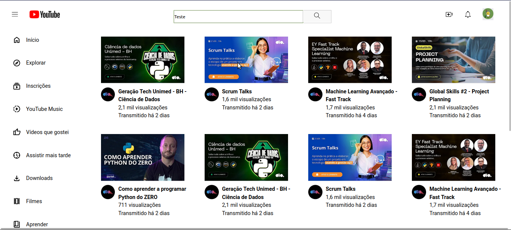
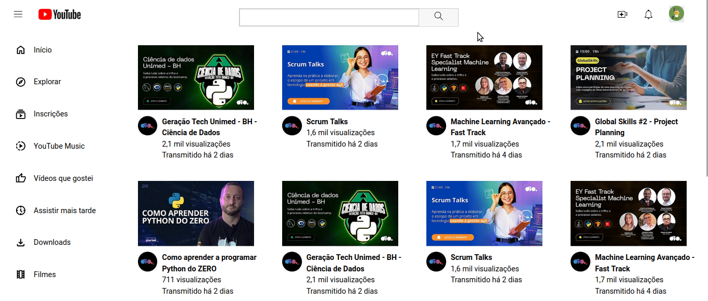

# Clone da Página de Grid de Vídeos do YouTube usando CSS Grid

Este repositório faz parte do curso de CSS da Digital Innovation One (DIO). O objetivo é clonar a página de grid de vídeos do YouTube utilizando técnicas avançadas de CSS, especialmente focando no uso do **Display Grid**.



## Sobre a Digital Innovation One (DIO)

A [Digital Innovation One](https://www.dio.me/) é uma plataforma educacional que oferece cursos online e gratuitos em diversas áreas da tecnologia. O curso de CSS proporciona conhecimentos essenciais para profissionais de front-end, abrangendo conceitos avançados como o uso eficiente do Display Grid.

## A Importância do Display Grid para Profissionais de Front-End

O **Display Grid** é uma poderosa ferramenta do CSS que permite a criação de layouts complexos e responsivos de forma mais intuitiva e eficiente. Para um profissional de front-end, dominar o Display Grid é crucial para desenvolver interfaces modernas e adaptáveis a diferentes dispositivos. Isso resulta em códigos mais limpos, manutenção facilitada e uma experiência do usuário aprimorada.

## Captura de Tela do Projeto



## Como Replicar este Repositório Localmente

1. Clone o repositório para a sua máquina local usando o seguinte comando:

    ```bash
    git clone https://github.com/seu-usuario/nome-do-repositorio.git
    ```

2. Acesse o diretório do projeto:

    ```bash
    cd nome-do-repositorio
    ```

3. Abra o arquivo `index.html` em seu navegador para visualizar o clone da página de grid de vídeos do YouTube.

Agora você está pronto para explorar e estudar as técnicas de CSS Grid aplicadas neste projeto!

**Divirta-se codificando!** 🚀